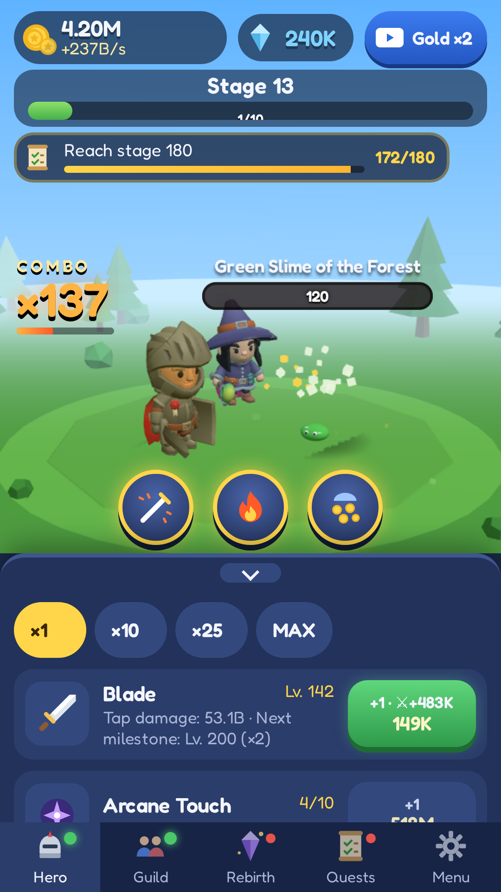
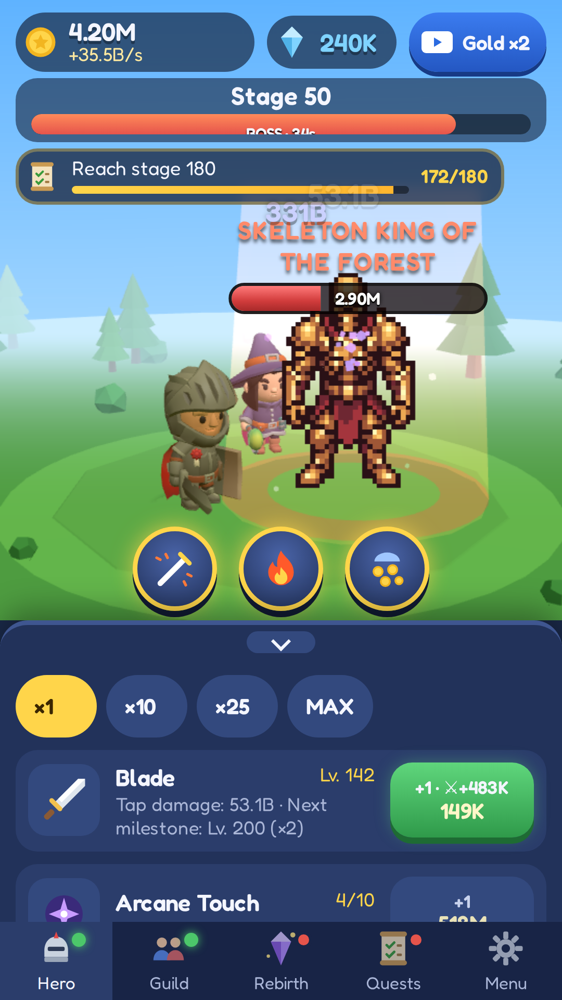
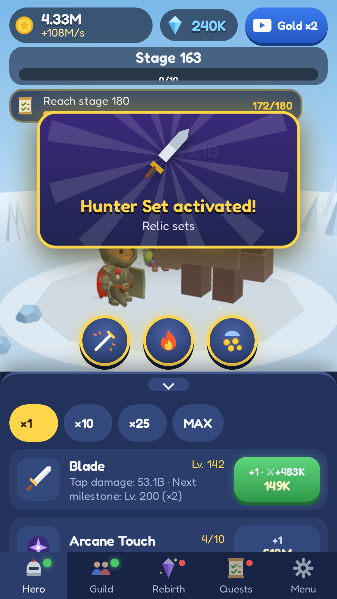
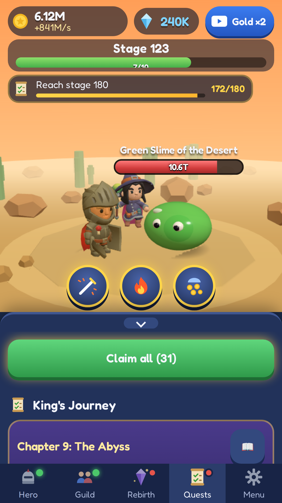

<p align="center"></p>

# Savior Boy: Idle Monsters

A game by **FSamp Labs**.

[Português](README.md) · **English** · [Español](README.es.md)

A low-poly 3D idle clicker RPG for **Android** (Capacitor + Three.js) that also runs in the browser, in **Portuguese, English and Spanish**.

<p align="center">
  
  
  
  
</p>

## The game
- **Tap** to attack; hold to attack non-stop. **Combos**, **Weak Spots** and crits.
- **12 enemy types** (skeletons and creatures) + rare Golden, Armored and Giant variants; a **Bestiary** with a permanent bonus.
- **Bosses:** a General every 10 stages and the **Skeleton King** (animated pixel art) every 50.
- A **guild** of 8 heroes + a Mage companion; **Arcane Touch**; 3 **abilities**.
- **Rebirth** with Soul Crystals and a Crystal Shop; **12 relics** and **8 looks**.
- **The King's Journey:** 10 chapters, 71 quests + endless ones; daily missions, achievements, daily reward, messenger chest and **offline progress**.
- **AdMob** ads (optional rewarded + rate-limited interstitial) with **UMP** consent.

## Run
```bash
npm install
npm run dev     # browser at http://localhost:5173
npm test        # tests (Vitest)
npm run build   # typecheck + web build
npm run sim     # balance simulator
```
Android: `npm run android:sync` and `npm run android:open` (Android Studio). Every push builds a **test APK** on GitHub Actions; a `v*` tag builds the **signed AAB** for Google Play.

## Documents (in Portuguese)
- [PUBLICAR.md](PUBLICAR.md): what's left to publish on Google Play (owner checklist)
- [SETUP_CONTAS.md](SETUP_CONTAS.md): keystore, AdMob, Secrets, Play Console, forms
- [store-listing/](store-listing/): store texts (3 languages), release notes, icon, feature graphic and screenshots
- [docs/](docs/): GitHub Pages site with the [privacy policy](docs/privacy-policy/index.html) and [terms of use](docs/terms/index.html) in 3 languages
- [CLAUDE.md](CLAUDE.md), [DECISIONS.md](DECISIONS.md), [CREDITS.md](CREDITS.md)

## Tech
Vite · TypeScript · Three.js · break_infinity.js · Capacitor 8 (Android, minSdk 24, targetSdk 36) · @capacitor-community/admob · Vitest.
