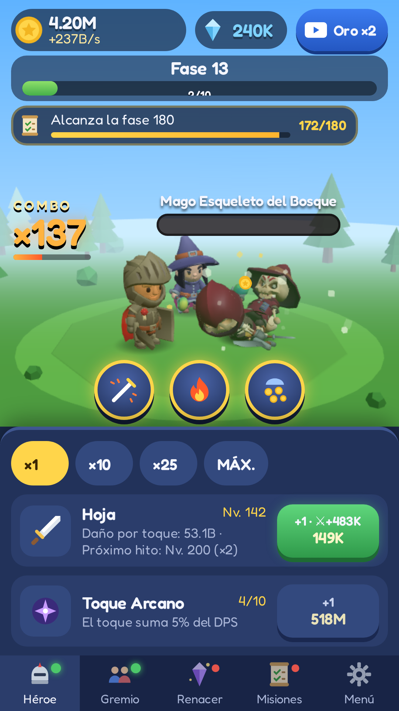
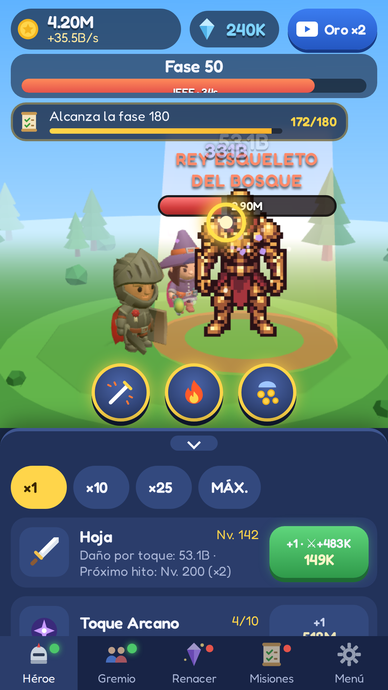
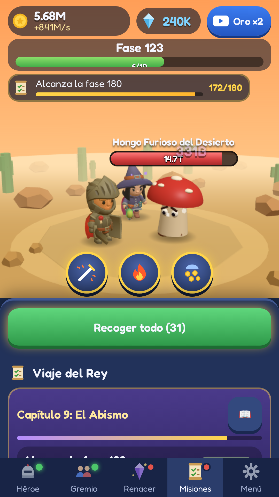

<p align="center"></p>

# King Idle Savior Boy

Un juego de **FSamp Labs**.

[Português](README.md) · [English](README.en.md) · **Español**

Clicker + RPG idle en 3D low-poly para **Android** (Capacitor + Three.js) que también funciona en el navegador, en **portugués, inglés y español**.

<p align="center">
  
  
  
  
</p>

## El juego
- **Toca** para atacar; mantén pulsado para atacar sin parar. **Combos**, **Puntos Débiles** y críticos.
- **12 tipos de enemigos** (esqueletos y criaturas) + variantes raras Dorado, Blindado y Gigante; **Bestiario** con bonificación permanente.
- **Jefes:** un General cada 10 fases y el **Rey Esqueleto** (pixel art animado) cada 50.
- **Gremio** de 8 héroes + compañera Maga; **Toque Arcano**; 3 **habilidades**.
- **Renacer** con Cristales del Alma y Tienda de Cristales; **12 reliquias** y **8 aspectos**.
- **El Viaje del Rey:** 10 capítulos, 71 misiones + infinitas; misiones diarias, logros, recompensa diaria, cofre del mensajero y **progreso sin conexión**.
- Anuncios **AdMob** (con recompensa opcionales + intersticial limitado) con consentimiento **UMP**.

## Ejecutar
```bash
npm install
npm run dev     # navegador en http://localhost:5173
npm test        # pruebas (Vitest)
npm run build   # typecheck + build web
npm run sim     # simulador de balance
```
Android: `npm run android:sync` y `npm run android:open` (Android Studio). Cada push genera un **APK de prueba** en GitHub Actions; una etiqueta `v*` genera el **AAB firmado** para Google Play.

## Documentos (en portugués)
- [PUBLICAR.md](PUBLICAR.md): lo que falta para publicar en Google Play (lista del dueño)
- [SETUP_CONTAS.md](SETUP_CONTAS.md): keystore, AdMob, Secrets, Play Console, formularios
- [store-listing/](store-listing/): textos de la tienda (3 idiomas), notas de versión, icono, gráfico y capturas
- [docs/](docs/): sitio de GitHub Pages con la [política de privacidad](docs/privacy-policy/index.html) y los [términos de uso](docs/terms/index.html) en 3 idiomas
- [CLAUDE.md](CLAUDE.md), [DECISIONS.md](DECISIONS.md), [CREDITS.md](CREDITS.md)

## Tecnología
Vite · TypeScript · Three.js · break_infinity.js · Capacitor 8 (Android, minSdk 24, targetSdk 36) · @capacitor-community/admob · Vitest.
