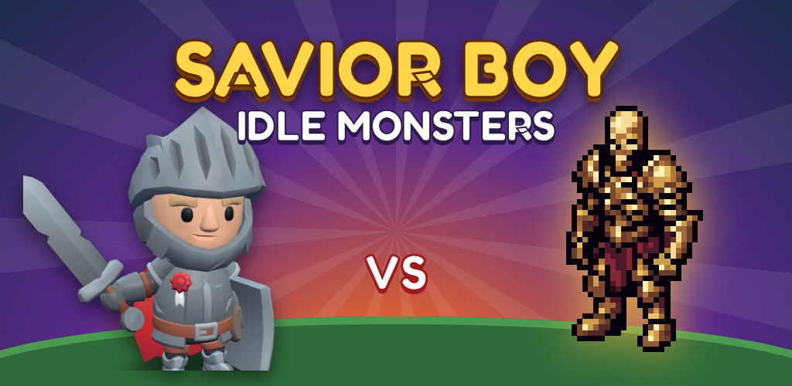
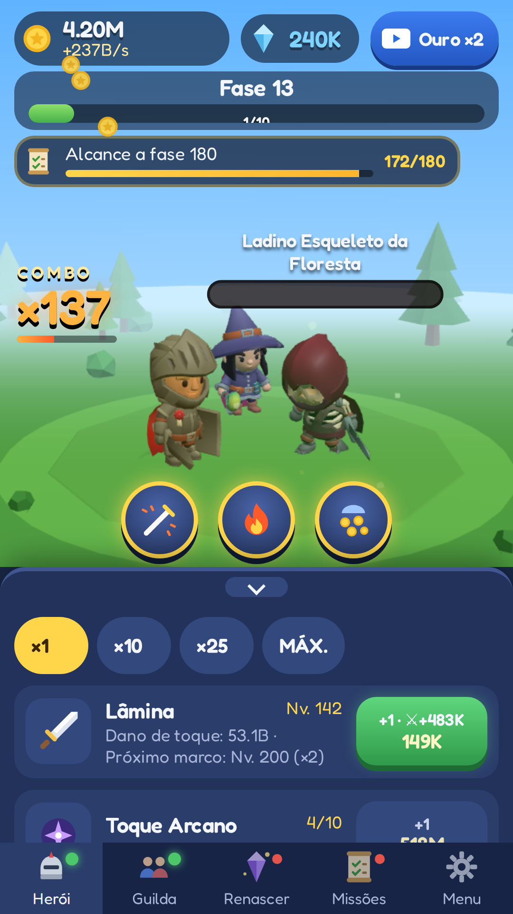
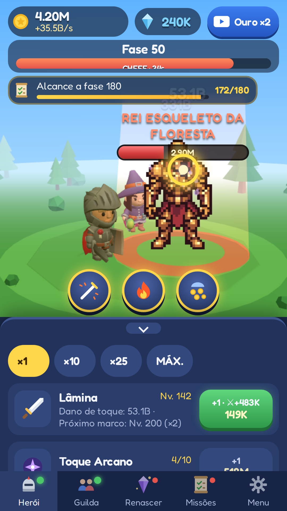
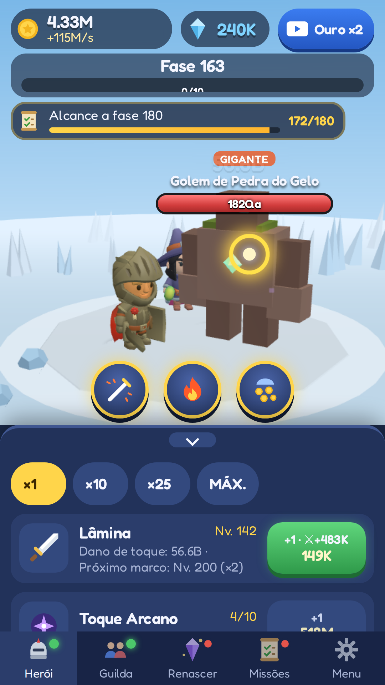
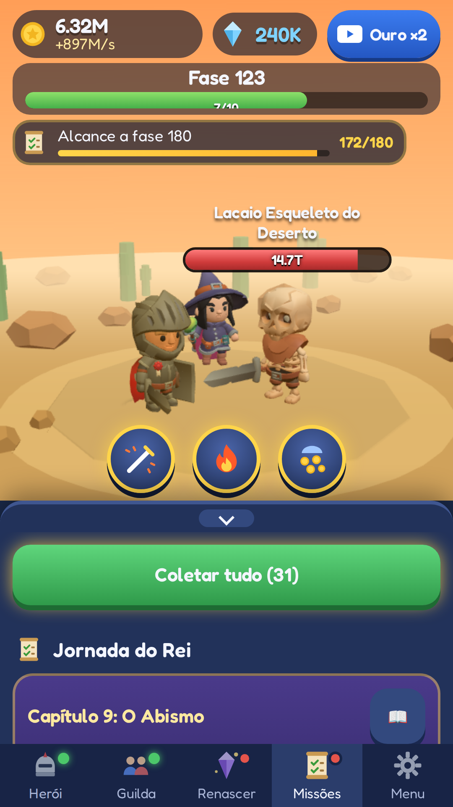

<p align="center"></p>

# Savior Boy: Idle Monsters

Um jogo de **FSamp Labs**.

**Português** · [English](README.en.md) · [Español](README.es.md)

Clicker + RPG idle em 3D low-poly para **Android** (Capacitor + Three.js) que também roda no navegador, em **português, inglês e espanhol**.

<p align="center">
  
  
  
  
</p>

## O jogo
- **Toque** para atacar; segure para atacar sem parar. **Combos**, **Pontos Fracos** e críticos.
- **12 tipos de inimigos** (esqueletos e criaturas) + variações raras Dourado, Blindado e Gigante; **Bestiário** com bônus permanente.
- **Chefes:** General a cada 10 fases e o **Rei Esqueleto** (pixel art animado) a cada 50.
- **Guilda** de 8 heróis + Maga companheira; **Toque Arcano**; 3 **habilidades**.
- **Renascer** com Cristais da Alma e Loja de Cristais; **12 relíquias** e **8 visuais**.
- **Jornada do Rei:** 10 capítulos, 71 missões + infinitas; missões diárias, conquistas, recompensa diária, baú do mensageiro e **progresso offline**.
- Anúncios **AdMob** (premiados opcionais + intersticial com limite), com consentimento **UMP**.

## Rodar
```bash
npm install
npm run dev     # navegador em http://localhost:5173
npm test        # testes (Vitest)
npm run build   # typecheck + build web
npm run sim     # simulador de balanceamento
```
Android: `npm run android:sync` e `npm run android:open` (Android Studio). Cada push gera um **APK de teste** no GitHub Actions ([TESTE_APK.md](TESTE_APK.md)); uma tag `v*` gera o **AAB assinado** para a Play.

## Documentos
| | |
|---|---|
| [PUBLICAR.md](PUBLICAR.md) | **O que falta para publicar** na Play Store (checklist do dono) |
| [SETUP_CONTAS.md](SETUP_CONTAS.md) | Passo a passo: keystore, AdMob, Secrets, Play Console, formulários |
| [store-listing/](store-listing/) | Textos da loja (3 idiomas), notas da versão, ícone, gráfico e screenshots |
| [docs/](docs/) | Site do GitHub Pages: [política de privacidade](docs/privacy-policy/index.html) e [termos de uso](docs/terms/index.html) em 3 idiomas |
| [CLAUDE.md](CLAUDE.md) | Guia de desenvolvimento e estrutura |
| [DECISIONS.md](DECISIONS.md) | Decisões técnicas e de balanceamento |
| [CREDITS.md](CREDITS.md) · [licenses/](licenses/) | Créditos e licenças (KayKit CC0, Fredoka OFL) |
| [CONFORMIDADE.md](CONFORMIDADE.md) | Relatório de conformidade (Play + AdMob) para revisão |

## Tecnologia
Vite · TypeScript · Three.js · break_infinity.js · Capacitor 8 (Android, minSdk 24, targetSdk 36) · @capacitor-community/admob · Vitest.
